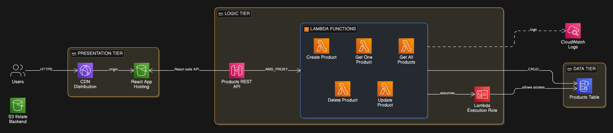

# 3 Tier Serverless Application

A fully serverless e-commerce platform on AWS where every layer — presentation, logic, and data — is managed through Terraform, demonstrating how organisations can eliminate server management while maintaining a production-grade deployment workflow.

## Overview

Most teams adopting serverless still deploy manually through the AWS console or with ad-hoc scripts. This project takes a different approach: the entire three-tier architecture is codified in Terraform modules, making the infrastructure reproducible, auditable, and version-controlled. A single `terraform apply` provisions everything from the CDN to the database.

The application itself is a product catalogue with full CRUD functionality. A React frontend served through CloudFront and S3 communicates with a REST API built on API Gateway and five individual Lambda functions, each responsible for a single operation against a DynamoDB table. The separation keeps each function small, independently deployable, and easy to reason about.

State is managed remotely in S3, IAM follows least-privilege with a dedicated Lambda execution role scoped to only the required DynamoDB actions and CloudWatch logging, and CORS is configured at the API Gateway level to allow the frontend origin.

## Architecture

Users hit a CloudFront distribution that serves the React SPA from an S3 bucket configured for static website hosting. The frontend calls a regional API Gateway REST API, which proxies each HTTP method (GET, POST, PUT, DELETE) to a dedicated Python Lambda function via AWS_PROXY integration. All five Lambdas share a single IAM role with policies scoped to DynamoDB CRUD operations and CloudWatch log writes. DynamoDB uses on-demand billing (PAY_PER_REQUEST) so there is no capacity planning required. Terraform remote state lives in a separate S3 bucket.

## Tech Stack

**Infrastructure**: AWS (CloudFront, S3, API Gateway, Lambda, DynamoDB, IAM, CloudWatch), Terraform with modular structure

**Backend**: Python 3.9 Lambda functions, Boto3 SDK

**Frontend**: React 18, Vite, React Router, LocalForage for client-side cart persistence

**State Management**: Terraform S3 backend for infrastructure state, useReducer pattern for frontend application state

## Key Decisions

- **One Lambda per operation instead of a monolithic handler**: Each CRUD action (get_all, get_one, create, update, delete) is its own function. This keeps cold starts minimal, allows independent scaling, and makes IAM permissions easier to tighten in the future if operations need different access levels.

- **Terraform modules mirroring the three tiers**: The infrastructure is split into `database/`, `backend/`, and `frontend/` modules with explicit outputs passed between them (e.g., `module.database.table_arn` feeds into the backend module). This mirrors how platform teams would structure shared infrastructure in a real organisation.

- **DynamoDB PAY_PER_REQUEST billing**: Avoids provisioned throughput capacity planning entirely. For a product catalogue with unpredictable traffic, on-demand billing eliminates the risk of throttling while keeping costs at zero during idle periods.

- **CloudFront in front of S3 rather than direct S3 website hosting**: Adds HTTPS by default, caching at edge locations, and custom error responses that redirect 404/403 to `index.html` for client-side routing support.

## Screenshots

## Author

**Noah Frost**

- Website: [noahfrost.co.uk](https://noahfrost.co.uk)
- GitHub: [github.com/nfroze](https://github.com/nfroze)
- LinkedIn: [linkedin.com/in/nfroze](https://linkedin.com/in/nfroze)
