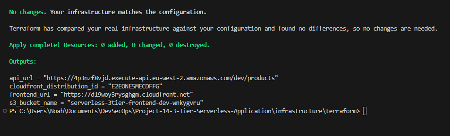

# 3 Tier Serverless Application

A fully serverless e-commerce platform on AWS where every layer — presentation, logic, and data — is managed through Terraform, demonstrating how organisations can eliminate server management while maintaining a production-grade deployment workflow.

## Overview

Most teams adopting serverless still deploy manually through the AWS console or with ad-hoc scripts. This project takes a different approach: the entire three-tier architecture is codified in Terraform modules, making the infrastructure reproducible, auditable, and version-controlled. A single `terraform apply` provisions everything from the CDN to the database.

The application itself is a product catalogue with full CRUD functionality. A React frontend served through CloudFront and S3 communicates with a REST API built on API Gateway and five individual Lambda functions, each responsible for a single operation against a DynamoDB table. The separation keeps each function small, independently deployable, and easy to reason about.

State is managed remotely in S3, IAM follows least-privilege with a dedicated Lambda execution role scoped to only the required DynamoDB actions and CloudWatch logging, and CORS is configured at the API Gateway level to allow the frontend origin.

## Architecture

Users hit a CloudFront distribution that serves the React SPA from an S3 bucket configured for static website hosting. The frontend calls a regional API Gateway REST API, which proxies each HTTP method (GET, POST, PUT, DELETE) to a dedicated Python Lambda function via AWS_PROXY integration. All five Lambdas share a single IAM role with policies scoped to DynamoDB CRUD operations and CloudWatch log writes. DynamoDB uses on-demand billing (PAY_PER_REQUEST) so there is no capacity planning required. Terraform remote state lives in a separate S3 bucket.

## Tech Stack

**Infrastructure**: AWS (CloudFront, S3, API Gateway, Lambda, DynamoDB, IAM, CloudWatch), Terraform with modular structure

**Backend**: Python 3.9 Lambda functions, Boto3 SDK

**Frontend**: React 18, Vite, React Router, LocalForage for client-side cart persistence

**State Management**: Terraform S3 backend for infrastructure state, useReducer pattern for frontend application state

## Key Decisions

- **One Lambda per operation instead of a monolithic handler**: Each CRUD action (get_all, get_one, create, update, delete) is its own function. This keeps cold starts minimal, allows independent scaling, and makes IAM permissions easier to tighten in the future if operations need different access levels.

- **Terraform modules mirroring the three tiers**: The infrastructure is split into `database/`, `backend/`, and `frontend/` modules with explicit outputs passed between them (e.g., `module.database.table_arn` feeds into the backend module). This mirrors how platform teams would structure shared infrastructure in a real organisation.

- **DynamoDB PAY_PER_REQUEST billing**: Avoids provisioned throughput capacity planning entirely. For a product catalogue with unpredictable traffic, on-demand billing eliminates the risk of throttling while keeping costs at zero during idle periods.

- **CloudFront in front of S3 rather than direct S3 website hosting**: Adds HTTPS by default, caching at edge locations, and custom error responses that redirect 404/403 to `index.html` for client-side routing support.

## Screenshots

**React Product Catalog Frontend** — The live e-commerce interface displaying the product catalogue with a promotional banner, category navigation, and product cards featuring headphones with prices and "Add to Cart" buttons. The frontend is served via CloudFront and S3 static hosting with client-side routing powered by React Router.

**Terraform Deployment Output** — The successful completion of a `terraform apply` operation, showing zero changes needed because infrastructure already matches the configuration. The output displays key deployment endpoints including the API Gateway URL, CloudFront distribution ID, and frontend URL—demonstrating the fully codified infrastructure approach.

**API Gateway REST API Console** — AWS API Gateway interface showing the serverless REST API resources with /products endpoint and HTTP methods (GET, POST, PUT, DELETE) configured with Lambda proxy integration, controlling how the frontend communicates with backend functions.

**Lambda Functions Overview** — AWS Lambda console listing all five individual serverless functions (create, delete, get_all, get_one, update) deployed for each CRUD operation, each independently scalable and responsible for a single database operation.

**DynamoDB Products Table** — AWS DynamoDB console showing the serverless-products-dev table configured with on-demand billing (PAY_PER_REQUEST), eliminating the need for capacity planning and providing automatic scaling based on traffic.

**S3 Frontend Bucket** — AWS S3 console displaying the serverless-3tier-frontend-dev bucket containing the built React application files, configured for static website hosting with CloudFront as the CDN layer in front.

**CloudFront Distribution Configuration** — AWS CloudFront console showing the CDN distribution details with S3 origin configuration, caching behaviors, and settings that provide HTTPS encryption, geographic distribution, and custom error handling for client-side routing.

**GitHub Feature Branches and Pull Requests** — GitHub repository interface displaying open pull requests with descriptive titles covering infrastructure, configuration, and testing improvements—demonstrating version control and code review practices for the DevSecOps workflow.

## Author

**Noah Frost**

- Website: [noahfrost.co.uk](https://noahfrost.co.uk)
- GitHub: [github.com/nfroze](https://github.com/nfroze)
- LinkedIn: [linkedin.com/in/nfroze](https://linkedin.com/in/nfroze)
